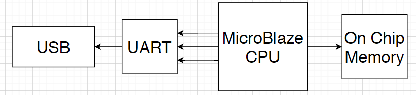
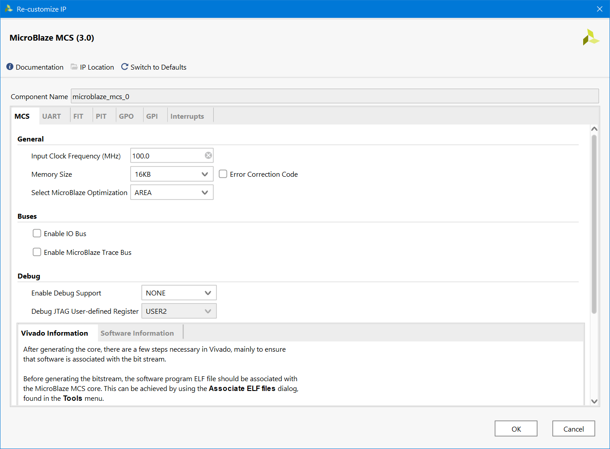
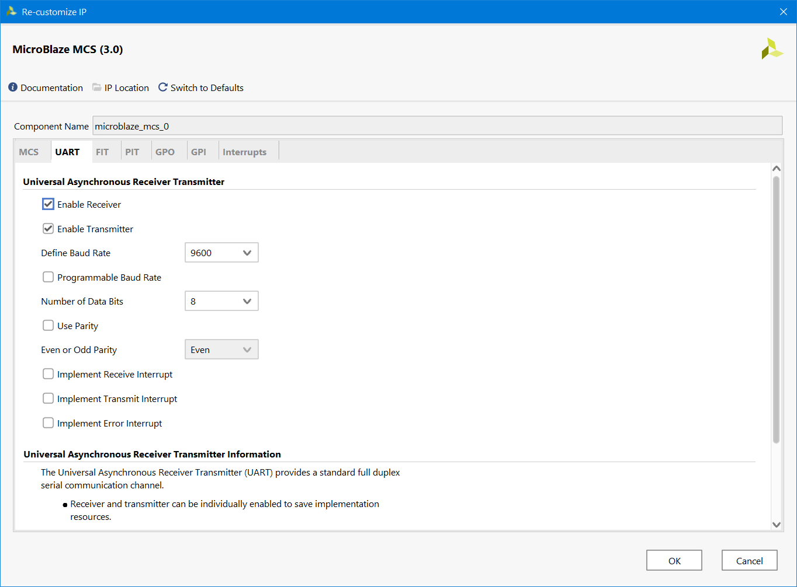
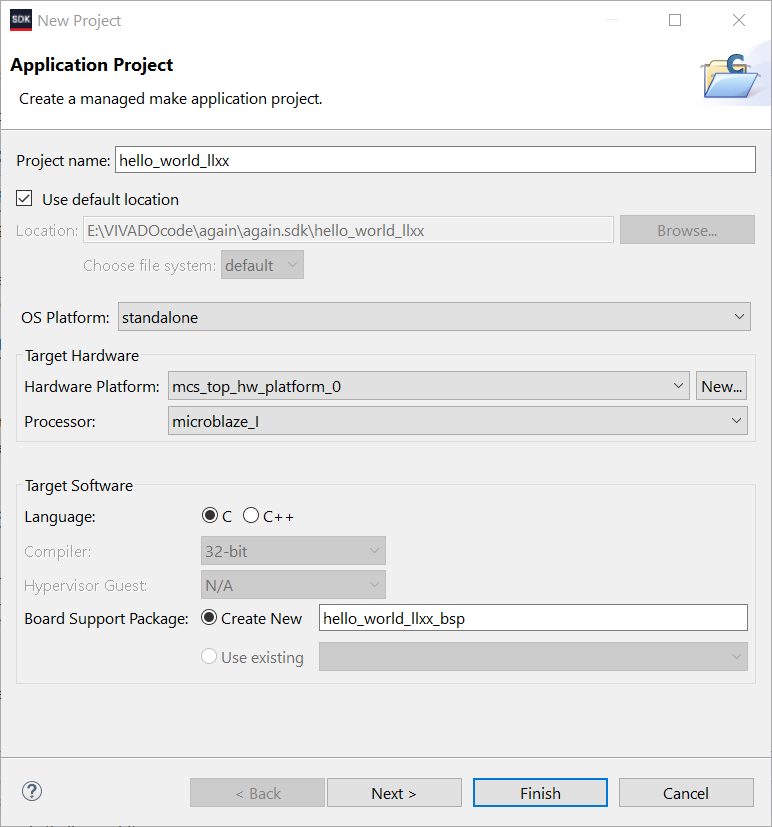
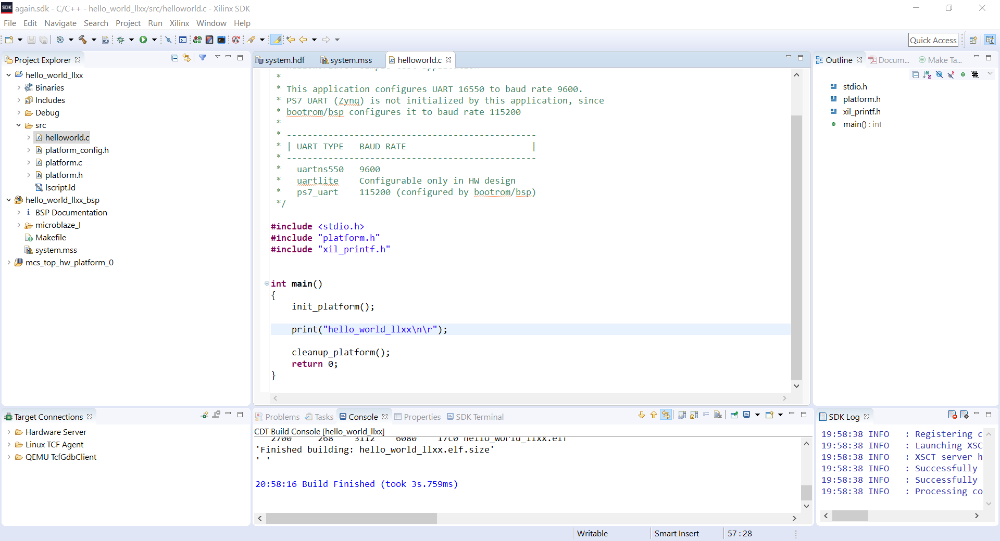
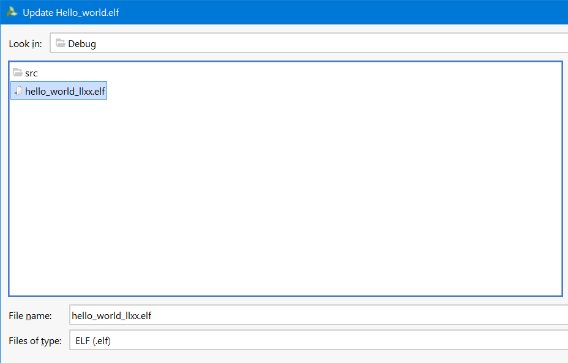
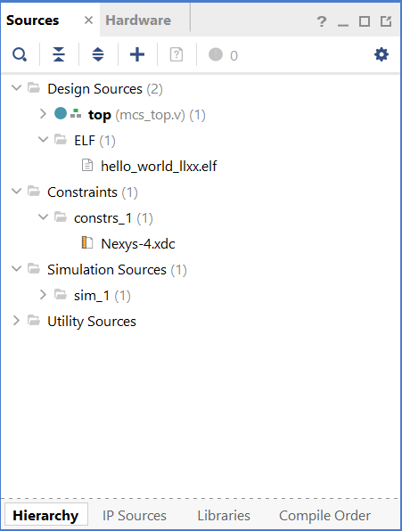
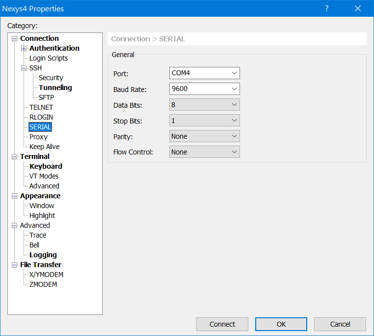
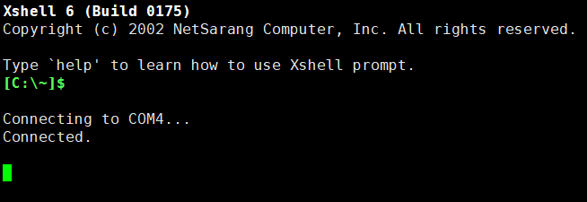
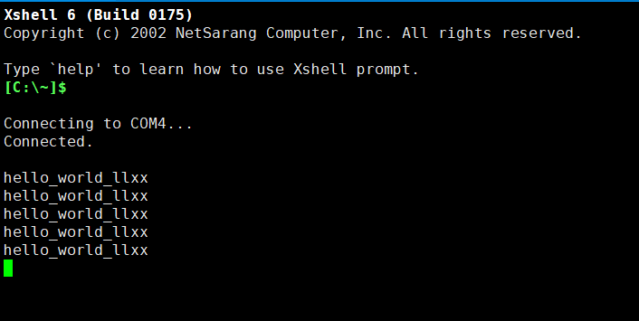

# llxx课程实验

## 实验目的

编写并运行一个简单C程序“hello_world_llxx”

## 系统组成

MicroBlaze CPU、on_chip_ram和JTAG UART

## 实验设计

#### 基本想法

1. MicroBlaze CPU是一个Xilinx的软核处理器。作为软核处理器，MicroBlaze可以完全在Xilinx FPGA的FPGA中实现。通过IP Core，可以很方便地生成该CPU
2. on chip ram理解为板上利用block ram或distribute ram生成的memory。也可以通过IP core生成
3. JTAG UART是一个可以通过USB UART从而和计算机进行信息处理的接口
4. 经过观察，可以发现在IP catalog中有一个叫做MicroBlaze MCS的IP Core可以同时完成以上三种IP Core的配置

#### 基本结构



## 实验过程

### 配置MicroBlaze MCS

#### 首先配置MCS部分，即设置MicroBlaze CPU的频率和on_chip_mem的大小



#### 配置UART

选中Enable Receiver和Transmitter，使用默认的9600bps的波特率



其他部分均保持默认

### 设置顶层文件

#### top.v文件

```verilog
module top(
    input clk,
    input rst,
    input uart_rx,
    output uart_tx
    );
    microblaze_mcs_0 mcs_0(
                            .Clk(clk),
                            .Reset(rst),
                            .UART_rxd(uart_rx),
                            .UART_txd(uart_tx)
                            );
endmodule
```

#### 约束文件

```verilog
set_property -dict { PACKAGE_PIN E3    IOSTANDARD LVCMOS33 } [get_ports { clk }]; #IO_L12P_T1_MRCC_35 Sch=clk100mhz
set_property -dict { PACKAGE_PIN C12   IOSTANDARD LVCMOS33 } [get_ports { rst }]; #IO_L3P_T0_DQS_AD1P_15 Sch=cpu_resetn
set_property -dict { PACKAGE_PIN C4    IOSTANDARD LVCMOS33 } [get_ports { uart_rx }]; #IO_L7P_T1_AD6P_35 Sch=uart_txd_in
set_property -dict { PACKAGE_PIN D4    IOSTANDARD LVCMOS33 } [get_ports { uart_tx }]; #IO_L11N_T1_SRCC_35 Sch=uart_rxd_out
```

### 设置hello_world_llxx文件

1. File->Export->Export Hardware->OK

2. 在Xilinx SDk中，File->New->Application Project
3. 创建一个如下设置的Project



并生成elf文件

4. 修改helloworld.c文件，并重新生成elf文件



5. 回到vivado，选择Tools -> Associate ELF files，选择刚刚生成的elf文件



得到的目录结构如下



6. 生成bitstream并program FPGA

### 测试UART结果

#### 连接UART接口

按照之前设置的9600bps的波特率设置Xshell





#### 测试结果

每次按下rst按钮，便会在Xshell的屏幕上打印出“hello_world_llxx”字样


